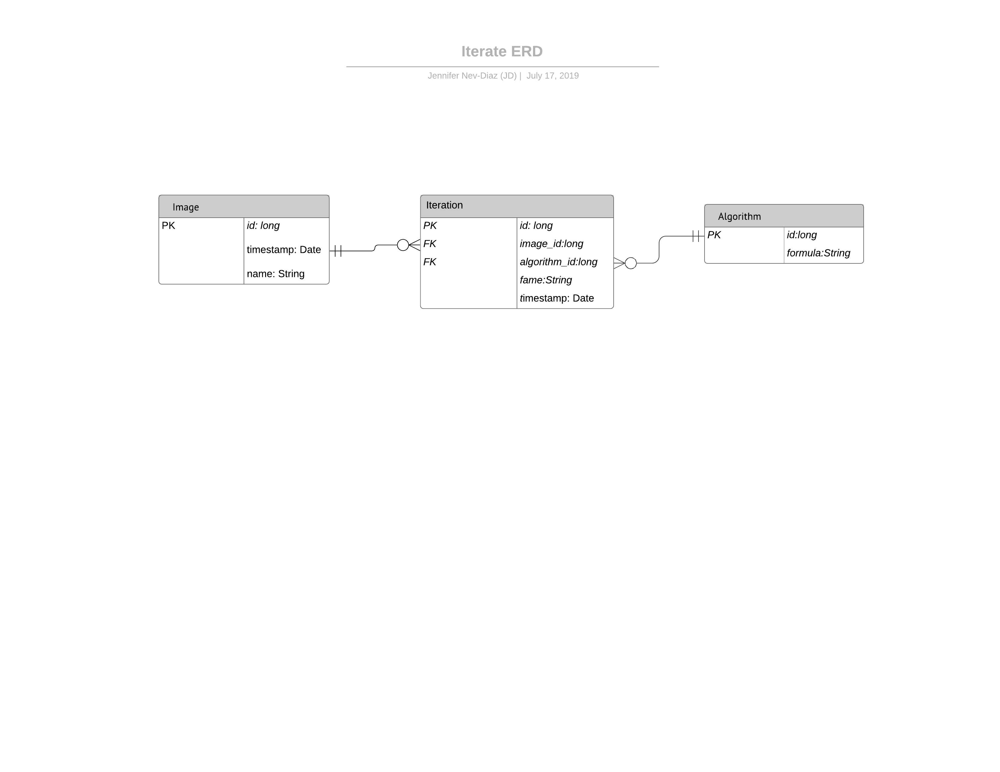

## ENTITIES AND ERD DOCUMENTATION

Entity types:
* Image
* Algorithm
* Iteration

Image Attribute types:
* PK id: long
* name: String
* timestamp:date

Algorithm Attribute types:
* PK id: long
* formula:String

Iteration Attribute types:
* PK id: long
* FK image_id: long
* FK algorithm_id: long
* timestamp:date
* name: String

