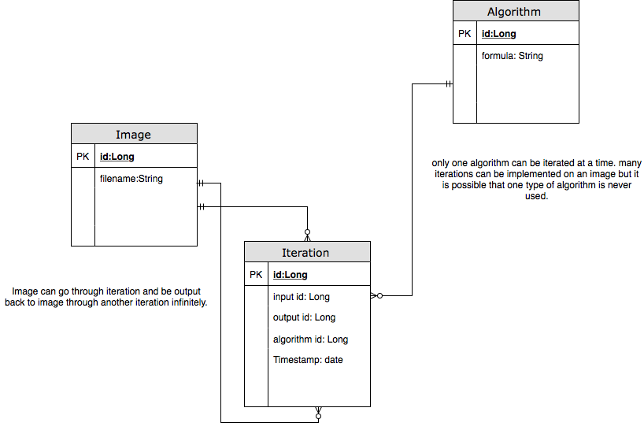

## ENTITIES AND ERD DOCUMENTATION

Entity types:
* Image
* Algorithm
* Iteration

Attribute types:
* id: long
* input id: long
* output id: long
* algorithm id: long
* timestamp:date
* formula: String

